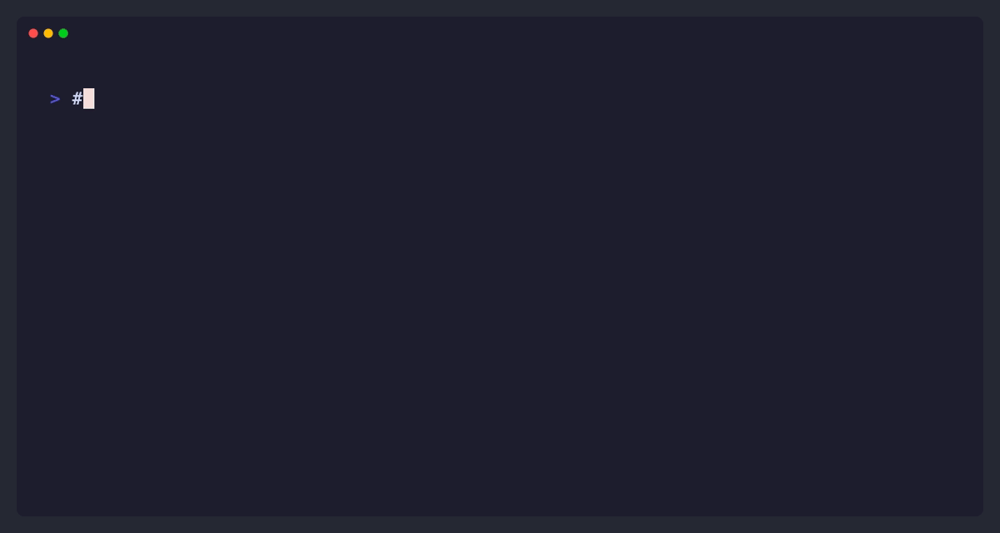

# 🚀 gmk (Git Mark)

<div align="center">


**The stylish, interactive Git bookmark manager for your terminal.**  
*Clone smarter, not harder.*

[Installation](#-installation) • [Usage](#-usage) • [Contributing](#-contributing)



</div>

---

## ✨ Features

- **🔖 Bookmark & Forget**: Save Git URLs (HTTPS or SSH) just once.
- **🔍 Fuzzy Finder**: Blazing fast search powered by [skim](https://github.com/lotabout/skim).
- **🌿 Smart Cloning**: 
  - `Enter`: Clone default branch.
  - `Ctrl + b`: Clone a **specific branch** interactively.
- **⚡ Zero Friction**: Auto-clearing UI that leaves only the logs you need.

## 📦 Installation

### Homebrew (macOS / Linux)

The easiest way to install.

```bash
brew tap kanywst/gmk https://github.com/kanywst/gmk
brew install gmk
```

### Cargo (Rust)

If you have Rust installed:

```bash
cargo install gmk
```

### Manual

Download the pre-compiled binaries from the [Releases](https://github.com/kanywst/gmk/releases) page.

## 🎮 Usage

### 1. Bookmark a Repo

Save a repository URL. `gmk` automatically parses the name.

```bash
gmk set https://github.com/rust-lang/rust.git
# Output: ✔ Saved: rust-lang/rust to bookmarks.
```

### 2. Interactive Clone

Run `gmk` without arguments to start the fuzzy finder.

```bash
gmk
```

|      Key       |                       Action                       |
| :------------: | :------------------------------------------------: |
|  **`Enter`**   |     Clone the **default** branch immediately.      |
| **`Ctrl + b`** | Prompt for a **specific branch** name, then clone. |

### 3. List & Options

```bash
gmk list            # List all bookmarks
gmk --shallow       # Shallow clone (--depth 1)
gmk -f              # Force overwrite existing directory
```

## 🛠️ Configuration

Configuration is stored in `~/.gmk/config.toml`.

```toml
[repos]
"rust-lang/rust" = "https://github.com/rust-lang/rust.git"
```

## 🏗️ Development

### Prerequisites

- Rust (latest stable)
- [vhs](https://github.com/charmbracelet/vhs) (optional, for regenerating demo.gif)

### Build

```bash
cargo build --release
```

### Regenerate Demo

```bash
make demo
```

---

<div align="center">
Built with 🦀 Rust in 2026 by <a href="https://github.com/kanywst">@kanywst</a>.
</div>
